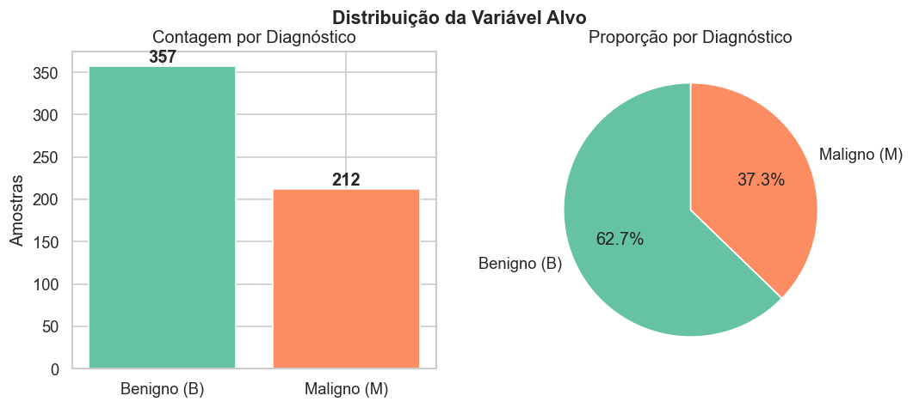
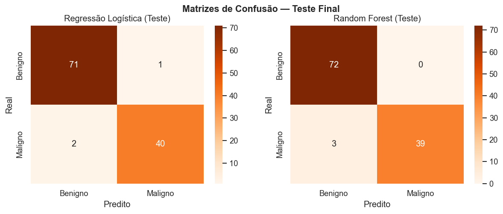
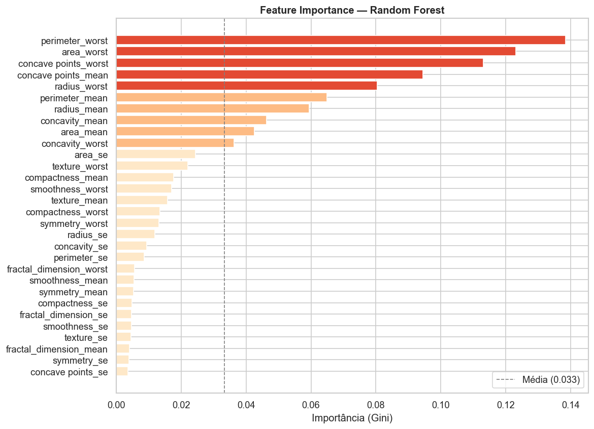
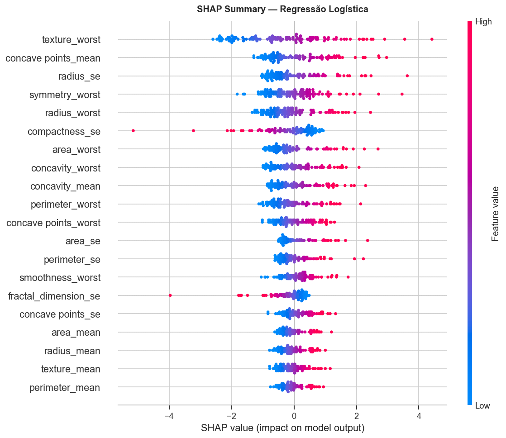

# Diagnóstico de Câncer de Mama: Tech Challenge B

Projeto de Machine Learning para classificar tumores de mama como malignos ou benignos a partir de medições extraídas de biópsias por agulha fina.

Dataset: Breast Cancer Wisconsin (UCI), 569 amostras, 30 features numéricas.

Modelo final: Regressão Logística. 97,4% de accuracy no teste, 95,2% de recall para a classe maligna, 2 falsos negativos de 42.

---

## O problema

O dataset contém medições de células extraídas de imagens de biópsias. Cada amostra tem 30 features (raio, textura, perímetro, área e derivados), medidas em três formas: média, erro padrão e o valor mais extremo encontrado. O objetivo é classificar o tumor como maligno (M) ou benigno (B).

A métrica principal não é accuracy. No contexto médico, um falso negativo (dizer que é benigno quando é maligno) é muito mais grave que um falso positivo. Por isso o modelo foi escolhido com base no **recall da classe maligna**.

---

## Notebooks

Os notebooks seguem uma ordem e precisam ser rodados em sequência:

| Notebook | O que faz |
|---|---|
| `01_eda.ipynb` | Análise exploratória: distribuições, correlações, separação entre classes |
| `02_preprocessing.ipynb` | Normalização, divisão treino/val/teste, pipeline de pré-processamento |
| `03_modeling.ipynb` | Treino de Regressão Logística e Random Forest, comparação, avaliação no teste |
| `04_explainability.ipynb` | Feature importance, SHAP values, análise de um falso negativo |

---

## Resultados

| Modelo | Accuracy | Recall (M) | Precision (M) | Falsos negativos |
|---|---|---|---|---|
| Regressão Logística | 97,4% | 95,2% | 97,6% | 2 de 42 |
| Random Forest | 97,4% | 92,9% | 100,0% | 3 de 42 |

Mesma accuracy, erros em lugares diferentes. O RF não gerou nenhum falso positivo, mas deixou passar mais malignos. A Logística foi escolhida por ter menos falsos negativos.

As features mais relevantes nas predições foram `texture_worst`, `concave points_mean`, `concave points_worst` e `area_worst`, que são características de irregularidade e tamanho das células nas regiões mais atípicas do tumor.

---

## Gráficos

Os notebooks salvam todos os gráficos na pasta `figures/`. Os principais estão abaixo.

**Distribuição das classes**


**Matrizes de confusão no teste**


**Feature importance (Random Forest)**


**SHAP summary (Regressão Logística)**


<!-- INSERIR IMAGEM: adicione aqui outras figuras da pasta figures/ que quiser destacar -->

---

## Como rodar

**Local**

```bash
python3 -m venv .venv
source .venv/bin/activate
pip install -r requirements.txt
jupyter lab
```

Rodar em ordem: `01_eda`, depois `02_preprocessing`, `03_modeling` e `04_explainability`.

O dataset `data/data.csv` precisa estar presente antes de começar. Download em [kaggle.com/datasets/uciml/breast-cancer-wisconsindata](https://www.kaggle.com/datasets/uciml/breast-cancer-wisconsindata/data).

**Docker**

```bash
docker build -t cancer-diagnosis .
docker run -p 8888:8888 -v $(pwd):/app cancer-diagnosis
```

Acesse `http://localhost:8888`.

---

## Estrutura

```
├── data/
│   ├── data.csv                  # dataset original (baixar do Kaggle)
│   └── processed/                # splits gerados pelo 02_preprocessing
│       ├── train.csv
│       ├── val.csv
│       └── test.csv
├── figures/                      # gráficos gerados pelos notebooks
├── models/                       # modelos e pipeline serializados (.pkl)
├── 01_eda.ipynb
├── 02_preprocessing.ipynb
├── 03_modeling.ipynb
├── 04_explainability.ipynb
├── relatorio_tecnico.md
├── requirements.txt
└── Dockerfile
```
