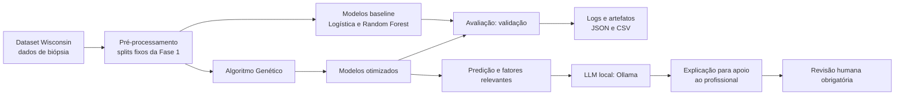

# Arquitetura — Fase 2

O sistema é um **apoio à triagem**, não um sistema de diagnóstico autônomo. O profissional de saúde continua responsável por interpretar o resultado junto com exames, imagem e histórico clínico.

## Fluxo de otimização

1. Os splits de treino, validação e teste criados na Fase 1 são reutilizados.
2. O GA cria cromossomos de hiperparâmetros, avalia-os somente na validação e seleciona os mais adequados por torneio.
3. O crossover uniforme combina genes de dois pais; a mutação troca genes aleatoriamente dentro dos limites definidos.
4. A fitness é `0,85 × recall maligno + 0,10 × F1 maligno + 0,05 × accuracy`.
5. Depois dos três experimentos, escolhe-se a melhor configuração pela validação e abre-se o teste uma única vez para o comparativo final.

O recall de malignos domina a fitness porque um falso negativo é o risco clínico mais grave. F1 e accuracy ainda participam da função para tornar explícito o custo de muitos falsos positivos.

## Escalabilidade e monitoramento

Na execução local, cada experimento produz logs com configuração do GA, número de avaliações, fitness, recall, F1 e falsos negativos. Os resultados estruturados são gravados em `outputs/<modelo>/` (ignorado pelo Git por serem artefatos reproduzíveis). A rota `GET /health` permite monitorar a disponibilidade da API de explicações.

O template em `infra/kubernetes/` configura a API com duas réplicas e um Horizontal Pod Autoscaler (HPA) de 2 a 10 réplicas quando o uso médio de CPU chega a 70%. Ele é infraestrutura como código e não foi aplicado a um provedor: a demonstração continua local e sem custo. Em produção, a API de predição deve ficar separada dos workers de otimização, que podem escalar de acordo com a fila de experimentos.
