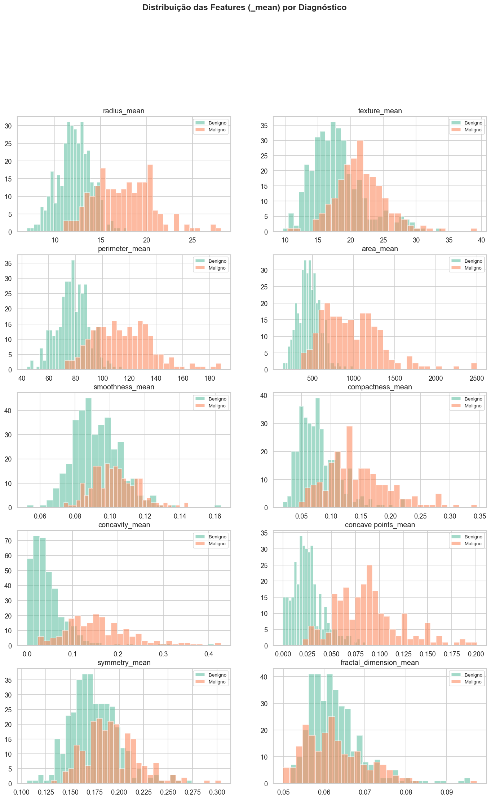
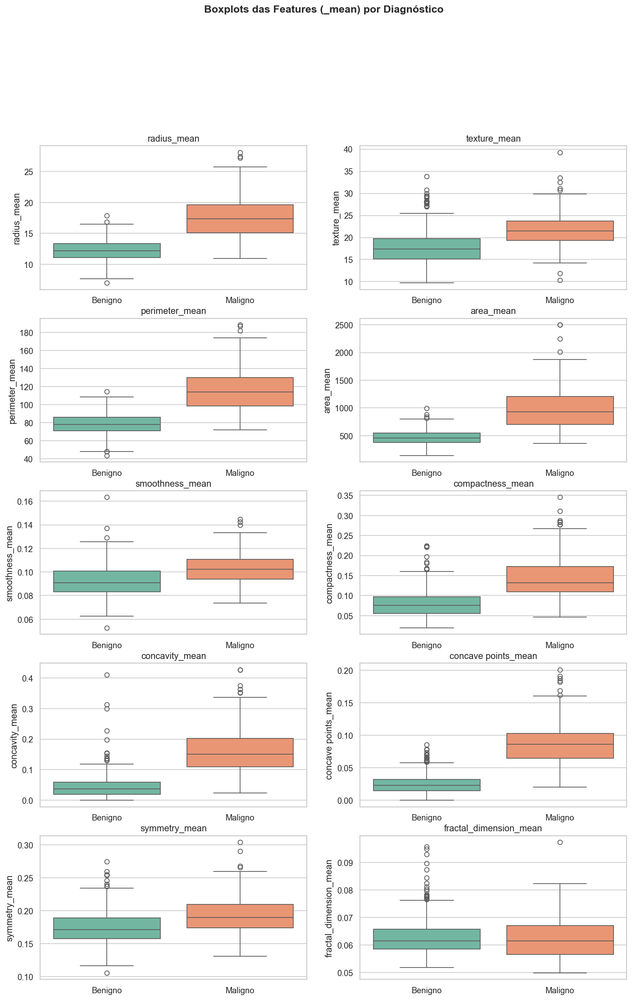
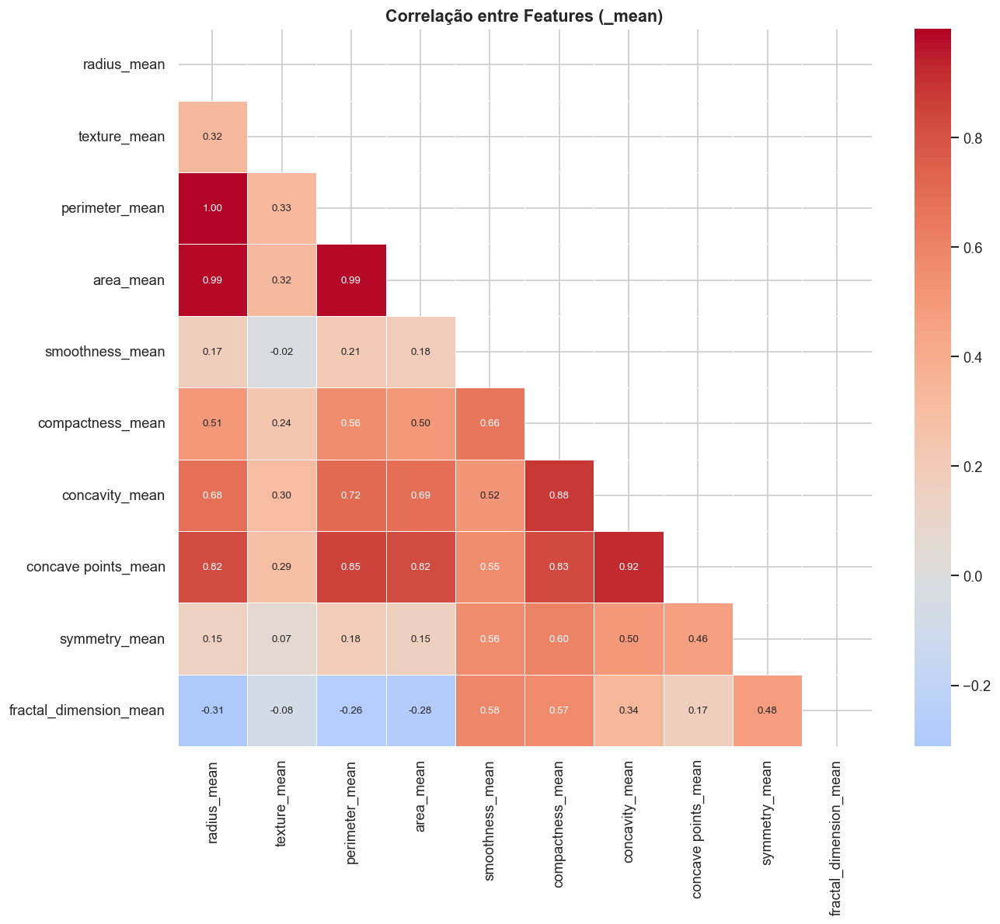
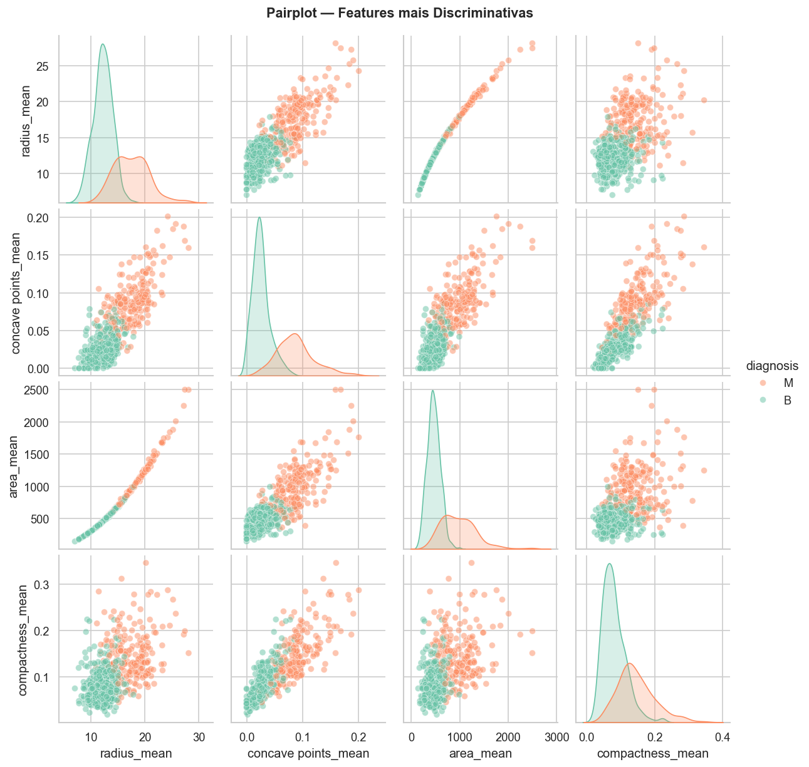
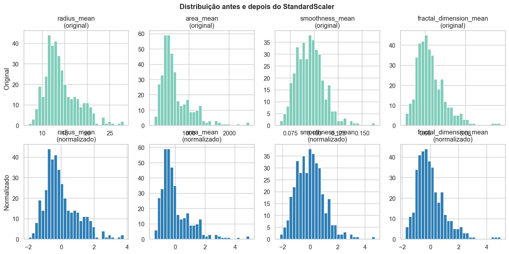
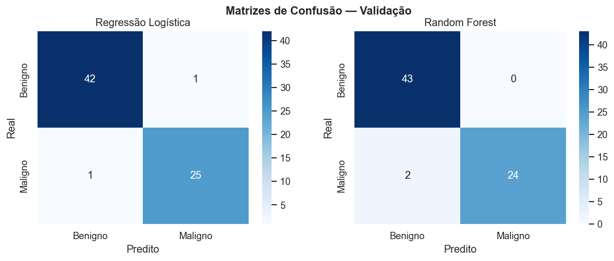
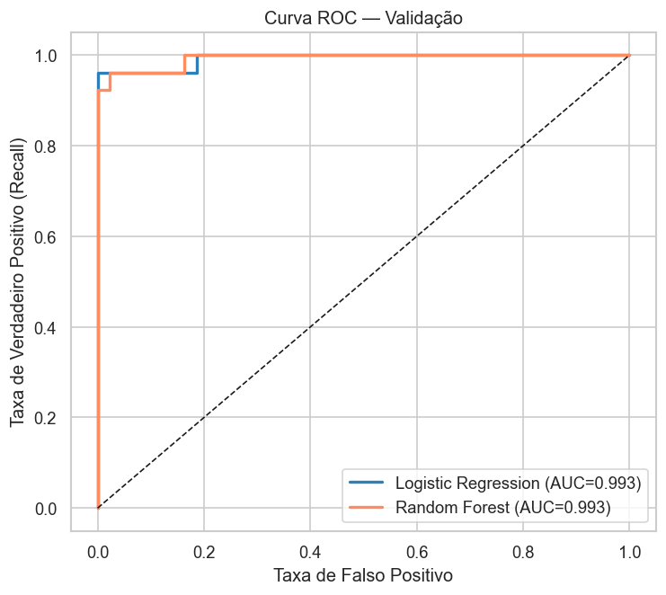
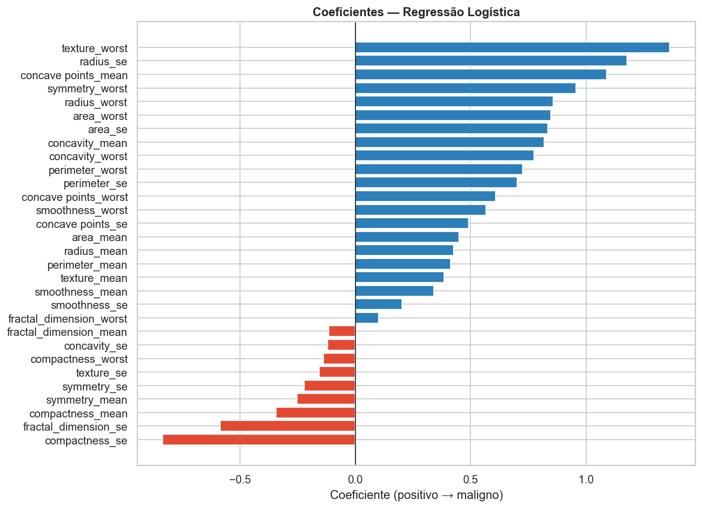
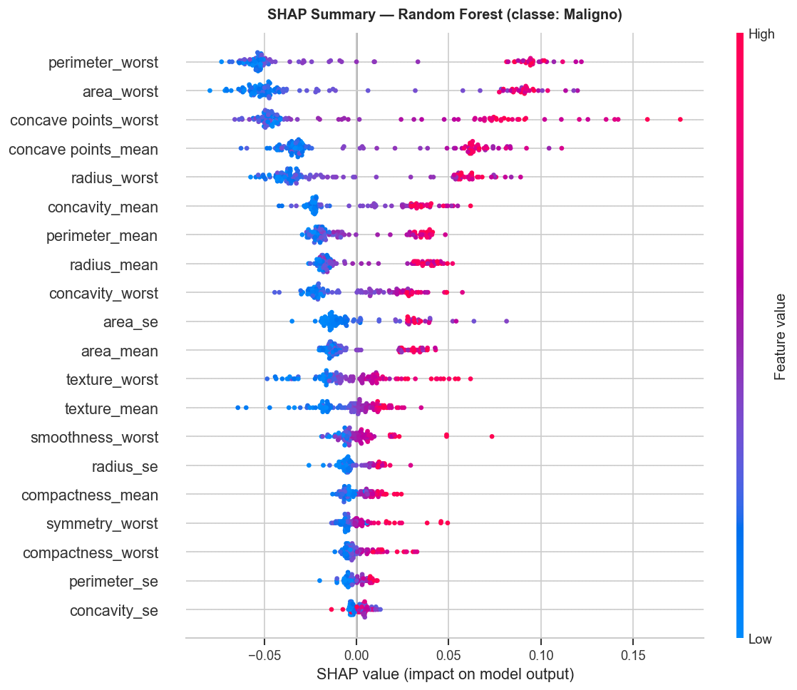
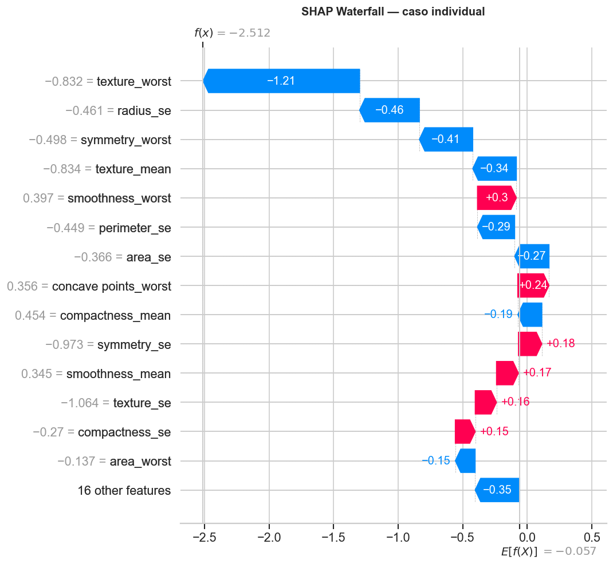

# Relatório Técnico: Tech Challenge B

---

## O problema

Tumores de mama, benigno ou maligno, a partir de medições extraídas de imagens de biópsia. O dataset é o Wisconsin Diagnostic, 569 amostras, 30 features numéricas: raio, textura, perímetro, área e mais uns derivados, medidos em três formas (média, erro padrão e o valor mais extremo encontrado na amostra).

A decisão mais importante do projeto não foi técnica. Foi reconhecer que os erros têm pesos diferentes. Dizer que um tumor maligno é benigno manda o paciente pra casa sem tratamento. Dizer que um benigno é maligno gera mais exames e ansiedade, mas o médico vai confirmar. Os dois erram, mas não da mesma forma. Isso mudou o critério de avaliação: não accuracy, mas recall da classe maligna.

---

## Notebook 01: Análise Exploratória

O primeiro passo foi entender o que tem nos dados antes de qualquer modelo: o que separa as classes visualmente, se tem dado faltando, se as features fazem sentido juntas.

**Qualidade dos dados:** zero missing values, zero duplicatas. A única limpeza necessária foi remover a coluna `Unnamed: 32` (completamente nula, artefato do CSV) e o `id` (só identificador, sem relação com o diagnóstico).

**Distribuição das classes:** 357 benignos (63%) e 212 malignos (37%). O dataset está desbalanceado, mas não de forma extrema. Não foi necessário oversampling.

**Features mais discriminativas:** `radius_mean`, `area_mean`, `concave points_mean` e `perimeter_mean` separam as classes com pouca sobreposição nos histogramas. Já `fractal_dimension_mean` e `texture_mean` têm distribuições praticamente idênticas entre B e M. Isoladas, essas últimas não dizem muita coisa sobre o diagnóstico.

**Escala heterogênea:** `area_mean` vai até 2501, `smoothness_mean` fica em torno de 0,1. Qualquer modelo sensível a distância vai precisar de normalização antes de funcionar bem.

**Multicolinearidade:** a correlação entre `radius`, `perimeter` e `area` fica acima de 0,99. Faz sentido geometricamente, perímetro e área são funções do raio. Ter as três é redundância por construção. Não foram removidas porque o Random Forest lida bem com isso e a Logística tem regularização, mas os coeficientes dela precisam ser lidos com cuidado por causa disso.

**Separação entre classes:** o pairplot mostrou separação boa entre as classes nas features mais discriminativas. Isso é bom (qualquer modelo razoável vai funcionar) e ruim ao mesmo tempo, porque pode dar a impressão de que o problema é mais simples do que é. Os casos clinicamente difíceis ficam exatamente na sobreposição, onde nenhum modelo vai ter certeza.

<!-- INSERIR IMAGEM: adicione aqui outras figuras da EDA que quiser destacar -->

---

## Notebook 02: Pré-processamento

A EDA não encontrou nada pra limpar. O trabalho aqui foi preparar os dados pra modelagem sem cometer os erros clássicos.

**Encode do target:** M foi mapeado para 1 e B para 0. Isso não é detalhe. Recall, F1 e a maioria das métricas calculam em cima da classe positiva por padrão. Se M fosse 0, o "recall" reportado seria o recall de benigno, que é o número errado pra monitorar.

**Três splits:** treino (68%), validação (12%) e teste (20%). Dois splits não bastam: se os hiperparâmetros forem ajustados olhando pro teste, ele deixa de ser teste e vira validação com nome errado. O conjunto de teste foi aberto uma única vez, no final, depois dos modelos fixados.

**Estratificação:** `stratify=y` em ambos os splits. Com 212 malignos de 569, um split aleatório sem estratificação podia facilmente colocar proporções muito diferentes de malignos em cada conjunto, tornando as métricas incomparáveis.

**Normalização com StandardScaler:** média 0, desvio padrão 1. Foi escolhido em vez do MinMaxScaler porque o MinMax usa o mínimo e o máximo observados pra comprimir tudo entre 0 e 1. Com os outliers que existem em `area_mean` (vai até 2501 com média de 654), o MinMax ia comprimir a maioria das amostras num intervalo pequeno. O Standard não resolve o outlier, mas pelo menos não distorce a escala de todo mundo por causa de uns poucos.

Regra que não pode ser quebrada: fit só no treino, transform em todos. Se o fit fosse feito no dataset inteiro, as médias e desvios do val e do teste contaminariam o scaler, e o modelo "saberia" alguma coisa sobre dados que não deveria ter visto.

**Pipeline:** o scaler foi empacotado num Pipeline do sklearn e salvo em disco. Assim qualquer dado novo passa pelo mesmo processamento automaticamente.

---

## Notebook 03: Modelagem

**Escolha dos modelos:**

Regressão Logística: é o modelo mais simples que faz sentido tentar quando a EDA mostra separação quase linear entre as classes. Interpretável, rápido, e os coeficientes têm significado direto. Se não funcionar, pelo menos vira baseline.

Random Forest: entra como contraste, não como upgrade. Não assume nada sobre a forma da fronteira de decisão. Se os dois chegam a resultados parecidos, o sinal nos dados é robusto.

**Resultados na validação:**

Accuracy idêntica nos dois: 97,1%. O que os separou foi onde cada um erra.

O Random Forest teve precision 100% pra classe M (não mandou nenhum benigno como maligno), mas o custo disso foi recall de 92,3%: 2 malignos classificados como benignos de 26. A Logística errou 1 maligno e teve 2 falsos positivos, com recall de 96,1%.

Pelo critério definido (recall de M), a **Regressão Logística** foi selecionada.

**Resultados no teste:**

| | Logistic Regression | Random Forest |
|---|---|---|
| Accuracy | 97,4% | 97,4% |
| Recall (M) | 95,2% | 92,9% |
| Precision (M) | 97,6% | 100,0% |
| Falsos negativos | 2 de 42 | 3 de 42 |

Mesma accuracy, erros em lugares diferentes. O RF não erra pra cima (falso positivo), mas erra mais pra baixo (falso negativo). A Logística faz o tradeoff inverso, e nesse contexto esse tradeoff é o correto.

---

## Notebook 04: Explicabilidade

**Feature importance (Random Forest):** as features com maior importância foram `perimeter_worst`, `area_worst` e `concave points_worst`, medidas das células nas regiões mais atípicas do tumor. Faz sentido clinicamente: tumores malignos tendem a ter células maiores e com bordas mais irregulares nas áreas mais extremas. `fractal_dimension` e `smoothness` ficaram com importância perto de zero, confirmando o que a EDA já sugeria.

**Coeficientes (Regressão Logística):** como as features foram normalizadas, os coeficientes são comparáveis. `texture_worst` teve o maior coeficiente positivo (pró-maligno), seguido de `radius_se` e `concave points_mean`. `compactness_se` teve o maior coeficiente negativo: alta variabilidade em compactidade empurra pra benigno. Pode refletir uma propriedade real dos tumores, mas vale investigar se aparece em outros datasets.

**SHAP values:** a análise global confirmou `texture_worst` e `concave points_mean` como as features que mais pesam nas predições de malignidade. São características de irregularidade e tamanho nas regiões mais atípicas das células, o que é biologicamente coerente.

Isso importa. Um modelo com 97% de accuracy que usa features sem relação com a doença vai quebrar em produção de formas que não aparecem nas métricas. O fato de as features mais importantes serem reconhecíveis em patologia é o mínimo pra considerar que o modelo aprendeu algo real.

**O falso negativo:** um dos casos incorretos recebeu probabilidade de 7,5% de ser maligno. O waterfall SHAP mostrou várias features empurrando simultaneamente pra benigno, com pouca contribuição pró-maligno. O tumor tinha medições que, em média no dataset, são associadas a benignidade. Não é um erro de lógica do modelo, é um caso que genuinamente parece benigno pelas features disponíveis, do tipo que um patologista experiente olharia a imagem inteira, não só as métricas.

---

## Limitações

4,8% de falsos negativos não é um resultado tranquilo. Em termos absolutos, de 42 tumores malignos no conjunto de teste, 2 seriam classificados como benignos. Num sistema autônomo de diagnóstico, isso seria inaceitável.

O uso que faz sentido é diferente: o modelo como ferramenta de triagem, não de diagnóstico. Ele processa as medições e devolve uma probabilidade com as features que mais pesaram naquele caso específico. O médico usa essa informação junto com a imagem, o histórico do paciente e outros exames. O modelo não decide, informa. A decisão clínica final é do profissional que tem acesso ao quadro completo.

Dois problemas que esse projeto não testa e que seriam críticos numa implantação real: o dataset vem de um laboratório específico, então um modelo treinado aqui pode degradar em outro equipamento com variações na coleta das imagens. E as probabilidades não foram calibradas, então um modelo que diz 70% não necessariamente acerta em 70% dos casos com essa probabilidade. Esses dois problemas não aparecem nas métricas de teste, mas são os problemas reais de ir pra produção.
